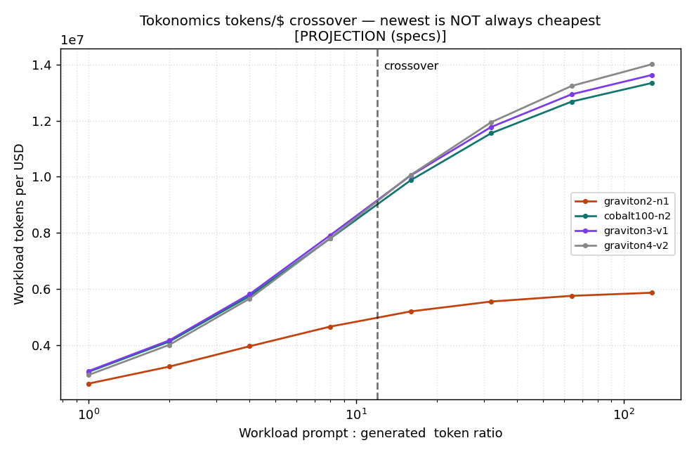

# Tokonomics

**The Arm64 LLM-inference economics lab.** `tokens` here means *LLM tokens*, not
crypto — this measures **tokens per dollar** and **tokens per joule** of running
small LLMs on Arm64 CPUs, and shows when the newest, most expensive instance is
*not* the cheapest place to run them.

[](https://github.com/Hokutoman00/tokonomics/actions/workflows/dev.yml)
[](https://github.com/Hokutoman00/tokonomics/actions/workflows/bench.yml)

> Forking? Replace `Hokutoman00` with your own owner. The Arm benchmark runs on
> GitHub's **free** `ubuntu-24.04-arm` runner (Neoverse N2, has i8mm) — no
> hardware to rent. Fork it, press *Run workflow*, and you regenerate every
> number below on your own silicon.

---

## Judge quickstart (under a minute, no Arm or C compiler)

```bash
pip install -e .          # pure-Python core
pytest -q                 # 45 passing: formulas, schema firewall, ingest, tokens/$ gate, driver↔pricing label contract, crossover falsifiability + flip-margin robustness
python -m tokonomics project   # regenerate the projected map + crossover + figures
python -m tokonomics report    # write REPORT.md from whatever results exist
```

Expected tail of `python -m tokonomics project`:

```
[project] crossover detected: True (winners: ['graviton3-v1', 'graviton3-v1',
  'graviton3-v1', 'graviton3-v1', 'graviton4-v2', 'graviton4-v2',
  'graviton4-v2', 'graviton4-v2'])
```

That single line *is* the finding: the cheapest instance flips from Graviton3
(decode-heavy) to Graviton4 (prefill-heavy). `REPORT.md` shows the full table.

**Measured on real Arm silicon — this repo already carries the maintainer's run**
(the headline slot in `REPORT.md`): [Actions run #27900233425](https://github.com/Hokutoman00/tokonomics/actions/runs/27900233425)
on the free Neoverse N2 runner built i8mm on/off, ran both the microkernel
ablation and a real `llama.cpp` model, and **committed the measured tokens/$ table
+ figures back into the repo** (`results/measured/`). Fork → **Actions → bench
(Arm N2) → Run workflow** to regenerate every number on *your* own silicon.

On real `llama.cpp` (Llama-3.2-1B Q4_0): i8mm lifts **prefill +29%** (200.8 → 258.6
tok/s, pp512) and moves **decode −12%** (49.9 → 43.9 tok/s, tg128) — inside the
±15% memory-bound noise band the ingest firewall pre-registers, i.e. i8mm does
**not** help decode (memory-bound), exactly as the roofline predicts and the
microkernel ablation shows. Raw JSON in [`results/measured/`](results/measured/).

---

## The one-line decision this produces

| Your traffic | Bottleneck | Cheapest Arm instance | Why |
|---|---|---|---|
| **Decode-heavy** (long generations, short prompts) | memory bandwidth | **Graviton3 / Neoverse-V1** | best bandwidth-per-$; i8mm can't help decode |
| **Prefill-heavy** (RAG, long prompts, short answers) | int8 compute | **Graviton4 / Neoverse-V2** | best compute-per-$; i8mm lifts prefill |

The newest, most expensive chip wins *only* the prefill-heavy column. This table
is generated from the swept data (`results/projected/crossover.json`), not
hand-asserted, and is replaced by measured silicon the moment CI runs.

---

## Three things this does that a tok/s table doesn't

1. **Within-silicon i8mm ablation (no confound).** We toggle Armv8.6 `MatMulInt8`
   (SMMLA) on/off *on the same CPU, same model, same build flags* and measure the
   prefill speedup directly — instead of comparing two different chips and
   guessing which difference mattered. `bench/microkernel/kernel.c` builds both
   the `vdotq_s32` (SDOT) and `vmmlaq_s32` (SMMLA) paths from one source, and each
   build checks its GEMM against a scalar reference **bit-for-bit** (`memcmp`
   against `gemm_ref`): on any mismatch the driver flags `correct:false` and exits
   non-zero, and the Python merge step **refuses** that run — so a path is admitted
   only when proven exact, and the only difference between the two binaries is the
   instruction.

2. **The newest instance is *not* always the cheapest.** Decode is memory-bound,
   prefill is compute-bound; i8mm lifts only the compute ceiling. Because
   memory-bandwidth-per-dollar has stagnated while compute-per-dollar advanced,
   the cheapest instance **flips** depending on your prompt:generation ratio.

   

3. **Reproducible by anyone, for free.** The whole pipeline is a fork-and-run
   GitHub Action — and a reusable `action.yml` that measures the bundled int8
   microkernel on *your* runner and **fails the build if tokens/$ regresses**
   below a floor you set (catching a runner/image/pricing change that silently
   makes int8 inference pricier; swap in your own `kernel.c` to gate your own
   kernel). The gate's decision logic is a unit-tested function
   (`tokonomics/gate.py`, `tests/test_gate.py`), not an inline shell snippet — so
   the check that fails your build is *exercised* in the suite, not just asserted.

---

## The physics in one paragraph

A roofline model (`tokonomics/model.py`) pins each phase to a ceiling:

- **decode** streams the full weight matrix per token → arithmetic intensity is
  low → it sits on the **memory** ceiling: `tok/s = mem_bw / model_bytes`.
  Raising the compute ceiling with i8mm does **almost nothing** for decode.
- **prefill** reuses weights across the prompt → high arithmetic intensity → it
  sits on the **compute** ceiling: `tok/s = peak_ops / (2·params)`. i8mm lifts
  this directly.

That asymmetry is *why* the cheapest instance depends on your workload, and the
lab makes it measurable **two ways** rather than asserted:

- **micro** — the `bench/microkernel` int8 GEMM ablation (i8mm lifts the GEMM);
- **macro** — a real `llama.cpp` run (`bench/llama`) on a GGUF model, ingested by
  `tokonomics llama` into a *measured* tokens/$ table where i8mm lifts **prefill
  (pp512)** while leaving **decode (tg128) unchanged within noise (−12%, inside
  the pre-registered ±15% memory-bound band)**. That real-model table is the
  headline of `REPORT.md` once CI has run — measured throughput, not a roofline
  derivation. If the macro decode were to move with i8mm, the ingest **refuses
  the run** (it would contradict the memory-bound claim), so the mechanism is
  falsifiable, not decorative.

The robust, now-measurable claim is that *mechanism* (prefill compute-bound and
i8mm-liftable; decode memory-bound and i8mm-immune). The exact prompt:gen ratio
where the cheapest instance flips is the one fragile, input-sensitive detail —
which is precisely what a measured CI run nails down.

## One command

```bash
make demo      # x86 pipeline check (real local numbers) + projection map + REPORT
make test      # unit tests (formulas, schema firewall, crossover falsifiability)
```

To get **measured Arm** numbers: fork, then **Actions → bench (Arm N2) → Run
workflow**. CI populates `results/measured/` and overwrites the figures with
on-silicon data.

## Honesty: three kinds of number, never mixed

This is a benchmark, so provenance is enforced in code (`tokonomics/schema.py`
rejects anything that would blur the line):

| label | meaning | where |
|---|---|---|
| ✅ **measured** | produced by the harness on real silicon (CI, Neoverse N2) | `results/measured/**` |
| 🧪 **dev proxy** | local **x86 float** run that validates the *pipeline*, not Arm int8 | `results/x86-dev/**` |
| 📐 **projection** | derived from **published specs** (Neoverse TRM / instance pricing) — an *estimate*, replaced by `measured` when CI runs | `results/projected/**` |

`results/measured/` here carries the maintainer's real Neoverse N2 run
([#27900233425](https://github.com/Hokutoman00/tokonomics/actions/runs/27900233425));
every Arm number traces to one of those committed JSONs — nothing in this repo
claims an Arm measurement that hasn't been made. The **+29% prefill headline is
traceable to raw**: `results/measured/llama_off.json` and `llama_on.json` are the
unedited `llama-bench` outputs (per-sample timings included — 200.8→258.6 tok/s
pp512, 49.9→43.9 tok/s tg128), and `tokonomics llama` re-derives the digested
`llama_economics.json` from them deterministically. The microkernel-derived
`economics.json` table in `REPORT.md` is, by contrast, a **roofline of the
measured int8 ceilings** (modeled tok/s, labelled as such — not real inference).
A fresh fork starts with the directory holding only `.gitkeep` and populates it
on the first `bench` run, so *your* numbers are produced by *your* runner, not
inherited. `tokens/J` always carries a `*`: power is TDP-derived (an estimate),
so it is a projection even when throughput is measured.

## Layout

```
bench/microkernel/   int8 GEMM (SDOT vs SMMLA), STREAM triad, JSON driver, ablation Makefile
bench/llama/         build llama.cpp i8mm on/off, bench pp/tg -> ingested to measured tokens/$
tokonomics/          roofline model, economics, crossover, schema firewall, CLI
econ/pricing.yaml    instance $/hr + TDP, each row with source URL + retrieved date
projection/specs.yaml  published Neoverse ceilings (i8mm on/off, mem BW), labelled projection
.github/workflows/   dev.yml (x86 tests + pipeline), bench.yml (free Arm N2 measured)
action.yml           reusable composite: tokens/$ regression gate (logic in tokonomics/gate.py, unit-tested)
```

## License

MIT — see [LICENSE](LICENSE).
